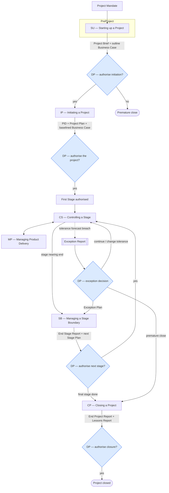
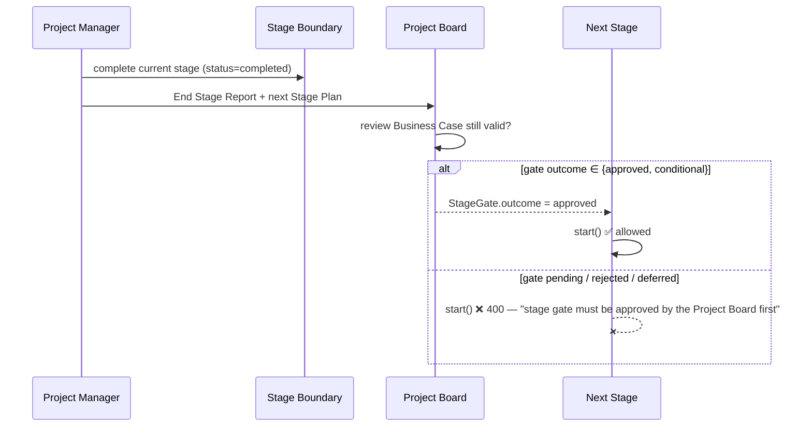
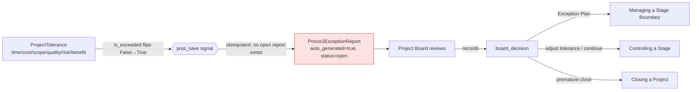

# PRINCE2 Process Design — ProjeXtPal

**Purpose.** This document is the process design for the PRINCE2 methodology as implemented in ProjeXtPal. It maps the canonical PRINCE2 process model (7 processes, 7 principles, 7 themes/practices, 26 management products) onto the actual ProjeXtPal backend models, API endpoints and frontend pages — and shows where the product **enforces** doctrine (a flow that blocks/escalates) versus merely **stores** it.

Legend: ✅ enforced by behaviour · ⚠️ stored, partial enforcement · ❌ not yet built.

---

## 1. The process model (end-to-end)



The **Directing a Project (DP)** decision gates (blue) are owned by the **Project Board**. Everything the Project Manager produces funnels into one of these board decisions. This is the spine of PRINCE2: *manage by stages* + *manage by exception* means the board only engages at stage boundaries and at exceptions — not in day-to-day control.

---

## 2. Process-by-process design

### SU — Starting up a Project
| | |
|---|---|
| **Trigger** | Project mandate (project created in ProjeXtPal, methodology = `prince2`) |
| **Activities** | Appoint Executive + PM, capture prior lessons, outline Business Case, assemble Project Brief, plan the initiation stage |
| **Management products** | Project Brief, outline Business Case, Daily Log, Lessons Log |
| **ProjeXtPal** | `ProjectBrief` (status draft→submitted→approved) · `BusinessCase` · `LessonsLog` · pages `Prince2ProjectBrief`, `Prince2BusinessCase`, `Prince2LessonsLog` |
| **Fidelity** | ✅ Brief + Business Case + Lessons captured from day one · ⚠️ no first-class **Daily Log** · ⚠️ prior-project lessons not auto-surfaced |

### DP — Directing a Project
| | |
|---|---|
| **Trigger** | Each stage boundary, each exception, request for ad-hoc direction |
| **Activities** | Authorise initiation / the project / each stage / closure; give ad-hoc direction; take exception decisions |
| **Management products** | Board decisions; authorisations recorded on Stage Gates and Exception Reports |
| **ProjeXtPal** | `ProjectBoard` + `ProjectBoardMember` (Executive / Senior User / Senior Supplier) · `StageGate.outcome` · `Prince2ExceptionReport.board_decision` · pages `Prince2ProjectBoard`, `Prince2StageGate`, `Prince2ExceptionReports` |
| **Fidelity** | ✅ Board + roles modelled & assignable · ✅ stage gate outcome gates the next stage (see §3) · ✅ exception decision field on the report |

### IP — Initiating a Project
| | |
|---|---|
| **Trigger** | DP authorises initiation |
| **Activities** | Assemble the PID (the four approaches + controls + tailoring), produce the Project Plan, baseline the Business Case, set up registers |
| **Management products** | PID, Project Plan, baselined Business Case, Risk/Issue/Quality registers |
| **ProjeXtPal** | `ProjectInitiationDocument` (status draft→**baselined**→updated) · `Prince2Risk` register · `Prince2Issue` register · page `Prince2Governance` |
| **Fidelity** | ✅ **PID baseline is gated**: cannot baseline without an *approved* Business Case **and** approved Project Brief (enforces *continued business justification*) · ⚠️ the four approaches (Risk/Quality/Change/Communication Mgmt) are not yet first-class products |

### CS — Controlling a Stage
| | |
|---|---|
| **Trigger** | Stage authorised / starts |
| **Activities** | Authorise & receive Work Packages, review status, capture + escalate risks/issues, report progress, watch tolerances |
| **Management products** | Work Packages, Risk/Issue Registers, Highlight Reports, Checkpoint Reports |
| **ProjeXtPal** | `WorkPackage` (+ `team_manager`, `depends_on`) · `Prince2Risk` · `Prince2Issue` · `HighlightReport` · `CheckpointReport` · `ProjectTolerance` · pages `Prince2WorkPackages`, `Prince2Risks`, `Prince2Issues`, `Prince2HighlightReport`, `Prince2Tolerances` |
| **Fidelity** | ✅ Risk register has owner + response type + lifecycle · ✅ Issue register types RFC/off-spec/problem-concern · ✅ WP dependencies · ✅ **tolerance breach auto-escalates** (see §4) |

### MP — Managing Product Delivery
| | |
|---|---|
| **Trigger** | CS authorises a Work Package |
| **Activities** | Team Manager accepts the WP, delivers products to quality, reports via Checkpoint Reports |
| **Management products** | Team Plan, Checkpoint Report, approved products |
| **ProjeXtPal** | `WorkPackage.team_manager` assignment · `CheckpointReport` · `Product` |
| **Fidelity** | ⚠️ WP accept/deliver is a status, not an authorise→accept handshake · ⚠️ no Team Plan as a distinct product |

### SB — Managing a Stage Boundary
| | |
|---|---|
| **Trigger** | Current stage nears its end, or an Exception Plan is requested |
| **Activities** | Update Project Plan + Business Case, produce next Stage Plan, write the End Stage Report, produce an Exception Plan if directed |
| **Management products** | Next Stage Plan, End Stage Report, updated Business Case, Exception Plan |
| **ProjeXtPal** | `Stage` (planned→active→completed/exception) · `StagePlan` · `StageGate` · pages `Prince2StagePlan`, `Prince2StageGate` |
| **Fidelity** | ✅ stage gate must be approved/conditional before the next stage can start · ⚠️ **Exception Plan** is not yet a distinct product (Exception Report exists; the resulting re-plan reuses Stage Plan) |

### CP — Closing a Project
| | |
|---|---|
| **Trigger** | Final stage complete, or premature-close direction from an exception |
| **Activities** | Confirm product acceptance, write End Project Report, capture follow-on actions, write Lessons Report, hand over benefits |
| **Management products** | End Project Report, Lessons Report, Benefits Management Approach, acceptance record |
| **ProjeXtPal** | `EndProjectReport` · `LessonsLog` · benefits review · closure checklist · pages `Prince2ProjectClosure`, `Prince2ClosureChecklist`, `Prince2BenefitsReview` |
| **Fidelity** | ✅ End Project Report + closure checklist + benefits review · ⚠️ benefits handover not gated on benefits actually being baselined |

---

## 3. Stage-boundary / gate flow (manage by stages — ✅ enforced)



**Enforcement point** — `StageViewSet.start()`: a stage cannot go `active` unless the *previous* stage is `completed` **and** its latest `StageGate.outcome ∈ {approved, conditional}`. This makes "manage by stages" a real gate, not a label.

---

## 4. Manage-by-Exception flow (✅ newly enforced)



**Enforcement point** — `prince2/signals.py`: when a `ProjectTolerance` transitions `is_exceeded` False→True, a board-facing `Prince2ExceptionReport` is auto-raised (cause pre-filled from the tolerance status). Idempotent — it will not pile up duplicate reports while one is still open/under_review/board_decision. This turns a tolerance from a boolean nobody reads into a real escalation path — the heart of *manage by exception*.

---

## 5. Key state machines

```mermaid
stateDiagram-v2
    direction LR
    state "ProjectBrief" as B { [*]-->draft: create
      draft-->submitted: submit
      submitted-->approved: board approves }
    state "PID" as P { [*]-->draft
      draft-->baselined: baseline()\n(requires approved BC + Brief)
      baselined-->updated: revise }
    state "Stage" as S { [*]-->planned
      planned-->active: start()\n(prev completed + gate approved)
      active-->completed: complete
      active-->exception: tolerance breach }
    state "ExceptionReport" as E { [*]-->open: auto/ manual
      open-->under_review
      under_review-->board_decision
      board_decision-->closed }
```

---

## 6. Management-product coverage map

| PRINCE2 product | ProjeXtPal model | Page | Status |
|---|---|---|---|
| Project Brief | `ProjectBrief` | Prince2ProjectBrief | ✅ |
| Business Case | `BusinessCase` (+ benefits, BC-risks) | Prince2BusinessCase | ✅ |
| PID | `ProjectInitiationDocument` | Prince2Governance | ✅ gated baseline |
| Stage Plan | `StagePlan` | Prince2StagePlan | ✅ |
| Stage Gate (boundary auth) | `StageGate` | Prince2StageGate | ✅ gates next stage |
| Work Package | `WorkPackage` (+team_manager, depends_on) | Prince2WorkPackages | ✅ |
| Product Description | `Product` | (in WP/Governance) | ⚠️ no quality-criteria enforcement |
| Risk Register | `Prince2Risk` | Prince2Risks | ✅ |
| Issue Register | `Prince2Issue` | Prince2Issues | ✅ |
| Tolerances | `ProjectTolerance` | Prince2Tolerances | ✅ |
| Exception Report | `Prince2ExceptionReport` | Prince2ExceptionReports | ✅ auto-raised |
| Highlight Report | `HighlightReport` | Prince2HighlightReport | ✅ |
| Checkpoint Report | `CheckpointReport` | (CS surface) | ⚠️ no dedicated page |
| End Project Report | `EndProjectReport` | Prince2ProjectClosure | ✅ |
| Lessons Log / Report | `LessonsLog` | Prince2LessonsLog | ⚠️ log ✅, report ⚠️ |
| Benefits Mgmt Approach | benefits review | Prince2BenefitsReview | ⚠️ partial |
| Daily Log | — | — | ❌ |
| Quality Register | — | — | ❌ |
| Configuration Item Records | — | — | ❌ |
| Product Status Account | — | — | ❌ |
| Exception Plan | (reuses Stage Plan) | — | ⚠️ |
| Risk/Quality/Change/Comms Mgmt Approaches | — | — | ❌ (folded into PID text) |

---

## 7. Gaps → next process-design increments (ranked)

1. **Exception Plan as a distinct product** — close the loop after an Exception Report's board decision = "produce Exception Plan" (plugs into SB / StagePlan).
2. **Daily Log** — lightweight PM log from SU onward (Learn from experience + informal issues).
3. **Quality Register linked to Product Descriptions** — make *focus on products* behavioural (quality criteria → quality checks → register).
4. **The four management approaches as first-class products** (Risk / Quality / Change / Communication) baselined inside the PID.
5. **Product Status Account** — roll-up of product states for the board (configuration management).
6. **Benefits Management Approach + gated benefits handover** at CP.

---

*Generated as the PRINCE2 process design for ProjeXtPal. The ✅ enforcement points (PID baseline gate, stage-start gate, tolerance→Exception escalation) correspond to commit `d7023ec3` on `sprint-yanmar-fit`.*
